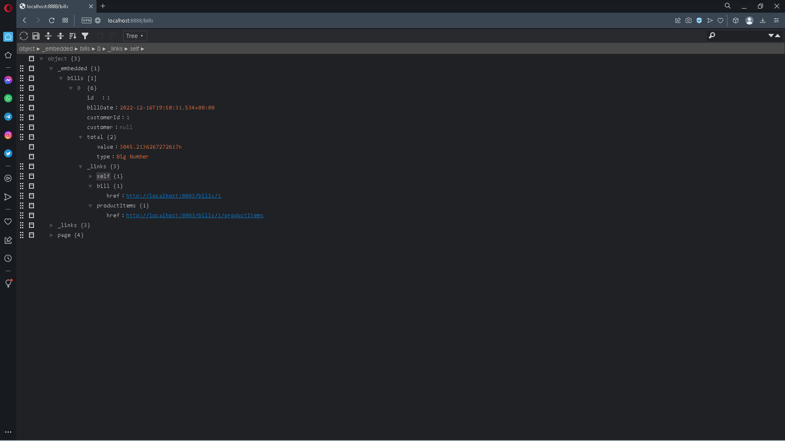

<h1>DISTRIBUTED ECOM APPLICATION</h1>
<h2>Front-End with Angular</h2>
<h3>Home</h3>

<h3>Products</h3>

<h3>Customers</h3>

<h3>Customer_bills</h3>

<h3>Bill details</h3>

<h2>Back-end with Spring Boot</h2>
<h3>Micro services</h3>
<h4>Customer service</h4>

Return a list of customers

Return a list of customers with projection

<h4>Inventory service</h4>

Return a list of products

<h4>Billing service</h4>

Return a list of bills

Return a list of productitems

Return the bill of customer

Return the full bill of customer

<h4>Gateway</h4>
<h5>Static routing</h5>

<h5>Dynamic Routing</h5>

<h4>Eureka Discrovery Service</h4>

<h2>Keycloak</h2>

En cours de preparation 

